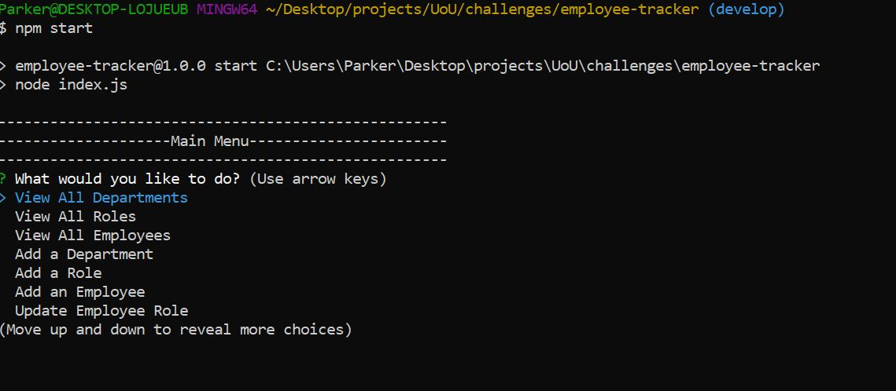
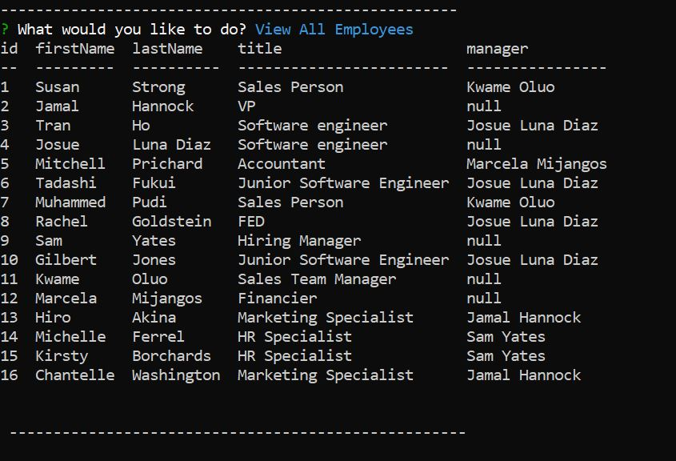
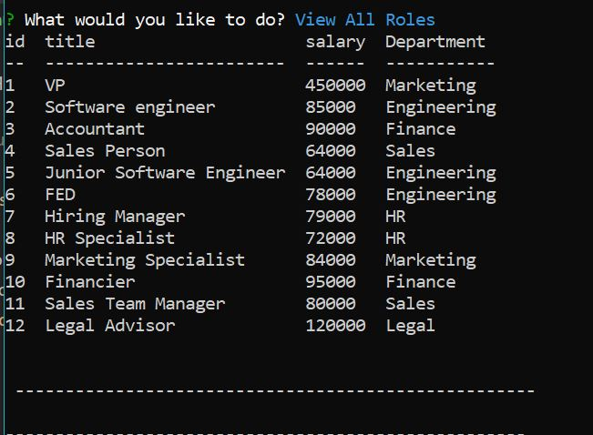
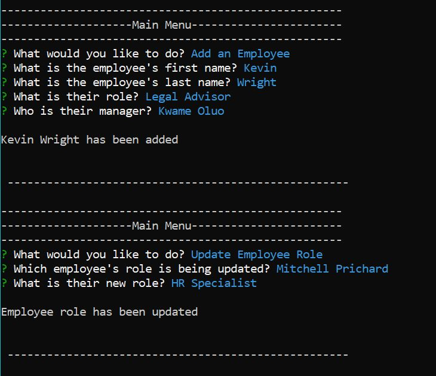

# Employee Tracker

  

  ## Description 
  
  This is a CLI application that allows a user to see and update employee information from a database. The program uses node.js, inquirer, MySQL and javascript to display employee, role, and department information. The user can select from a list of actions to take including viewing data, adding, data and changing data in the data base. This application was made so that a supervisor could very quickly gather and view information about the companies employees.
  
  
  
  
  
  ## Table of Contents
  
  * [Installation](#installation)
  * [Usage](#usage)
  * [Credits](#credits)
  * [License](#license)
  

  ## Installation
  
  1) Copy the repository to a local folder. 
  2) Download node.js 
  3) Download MySQL and have a MySQL account.
  
  ## Usage 

  To run the program enter your MySQL password in between the '' on line 7 of the dbFunctions.js file. Save the file and then navigate to the root folder of the program. Enter in 'npm start' into the CLI and follow the prompt.
  
   
  ## License

  Apache

  

  ## Questions
  If you run into any errors or have further questions about this program, you can contact here: 
  
  *github: https://github.com/parkerrobison 
  
  *email: parkerobison@gmail.com.
  
  Please reference the project in question in the message. Thank you.
